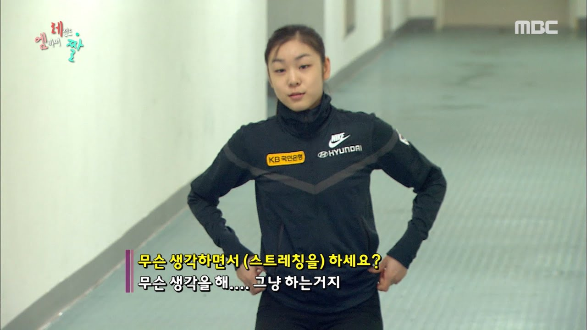

    

     

  

### BomLee
Blog: [https://bomlee427.github.io/](https://bomlee427.github.io/)

개발에는 지름길이 없다는 걸 이제야 깨달은 1년차 개발자.

그래도 하루 한 뼘이라도 앞으로 가려고 합니다.

<!--

**BomLee427/BomLee427** is a ✨ _special_ ✨ repository because its `README.md` (this file) appears on your GitHub profile.

Here are some ideas to get you started:

- 🔭 I’m currently working on ...
- 🌱 I’m currently learning ...
- 👯 I’m looking to collaborate on ...
- 🤔 I’m looking for help with ...
- 💬 Ask me about ...
- 📫 How to reach me: ...
- 😄 Pronouns: ...
- ⚡ Fun fact: ...
-->
